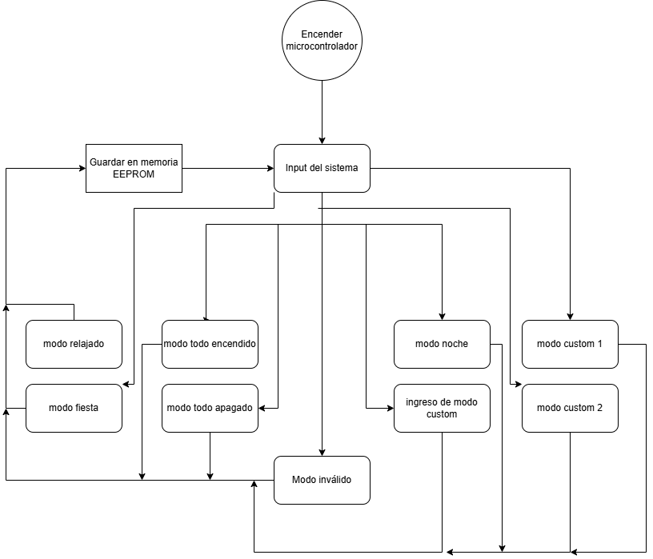
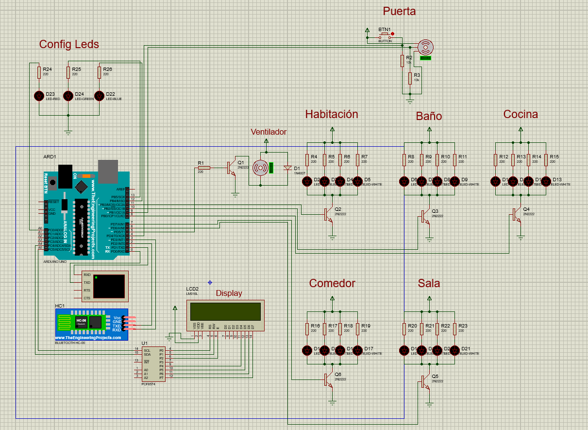

# Proyecto 1

*Grupo No. 8*


# Video explicativo

```
https://youtu.be/sQ2Ajn-4dlA
```


# Introducción

En este proyecto se desarrolló el sistema bajo el nombre SmartHome GT, un sistema destinado a la automatización de una vivienda utilizando Arduino UNO.

El proyecto tiene como principal aplicación, representar la automatización que se puede realizar en modelos reales a gran escala, pero de una forma que sea educativa y accesible para el estudiante.

En este documento se desarrollará el análisis y la parte técnica del proyecto, justificando y dando explicación a cada uno de los módulos solicitados por el proyecto.  Así como también se expondrán los problemas encontrados, soluciones aplicadas, procesos de creación y funcionalidades implementadas.

# Descripción del problema

Se requiere que una vivienda tenga interconectados diferentes dispositivos como luces LED, un ventilador (utilizando un motor DC), un motor servo y una pantalla LCD. En este caso para lograr el modelo se realizó una maqueta para representar el funcionamiento de cada módulo.

El proyecto incluye tres partes principales, la creación del circuito y las conexiones con los componentes, el código de arduino y el manejo de su memoria, y finalmente la conexción a un módulo electrónico para funcionamiento Bluetooth.

De esta forma, utilizando estos componentes, se logró automatizar acciones en la casa a través de diversos modos y finalmente ell flujo de trabajo es el siguiente:

- Primero: Se envía una selección de modo a través del dispositivo receptor de bluetooth.

- Segundo: El Arduino, toma la solicitud, y mediante su código, guarda el modo seleccionado en la memoria, y a través de sus pines, realiza la acción solicitada, encendiendo los dispositivos conectados que el modo indica.

- Tercero: El módulo bluetooth espera una nueva instrucción para cambiar de modo, el Arduino mantiene el último modo que le fue implementado.

# Lógica del sistema

Para la lógica de este proyecto principalmente se utilizan los pines digitales del arduino controlados directamente desde el microcontrolador, esto quiere decir que no hay diseño digital ni secuencial puro implementado en el sistema, únicamente depende del código del arduino.

Dentro del código del arduino podemos encontrar diversas aplicaciones y funcionalidades que si hacen uso de lógica y requieren ciertas condiciones basadas en los modos seleccionados, estas son:

* Código condicional para elegir un modo, que hace que el display demuestre el modo que está activo

* Código para guardar el último modo utilizado en la EEPROM

* Código para almacenar los datos de un archivo .ORG cargado o de texto con formato específico ingresado

* Código para el funcionamiento del botón junto al motor servo

* Código para el display de los LEDs que indican el estado de la configuración

* Código para los LEDs de cada escenario, como también del motor DC (ventilador)

A través de la configuración de pines inicial y del código dedicado a cada una de estas funcionalidades, tenemos finalmente la parte lógica del sistema, que se  encarga en todo momento de mantener la parte física en funcionamiento.

# Funciones booleanas y diagrama de estados

Ya que no es necesario el uso directo de lógica combinacional, únicamente se cuenta con diagrama de estados para este proyecto.

 

# Diagrama de circuito

Este diagrama representa las conexiones del circuito en una simulación de proteus funcional



# Equipo y presupuesto

| No. | Artículo                              | Cantidad | Precio Unitario | Subtotal |
| --- | ------------------------------------- | -------- | --------------- | -------- |
| 1   | METRO UTP PARA RED CAT5               | 2        | Q3.00           | Q6.00    |
| 2   | MODULO BLUETOOTH HC-06  4 PINES       | 1        | Q75.00          | Q75.00   |
| 3   | PANTALLA LCD 2X16 CON I2C             | 1        | Q65.00          | Q65.00   |
| 4   | SERVO SG90 180° 1.3KG 4.8V-6VDC       | 1        | Q35.00          | Q35.00   |
| 5   | MOTOR CUADRADO 3-6VDC                 | 1        | Q15.00          | Q15.00   |
| 6   | PULSADOR 2 PINES NA 6X6X5MM           | 2        | Q1.00           | Q2.00    |
| 7   | TRANSISTOR 2N2222 NPN 60VDC 800MA     | 2        | Q1.00           | Q2.00    |
| 8   | 1N4007 DIODO RECTIFICADOR 1000V 1A    | 2        | Q1.00           | Q2.00    |
| 9   | RESISTENCIA CARBON 220 OHM 0.25W 1/4W | 20       | Q0.75           | Q15.00   |
| 10  | RESISTENCIA CARBON 1K OHM 0.25W 1/4W  | 5        | Q0.75           | Q3.75    |
| 11  | LED 5MM AZUL DIFUSO                   | 1        | Q1.00           | Q1.00    |
| 12  | JUMPER MACHO HEMBRA 20CM              | 20       | Q0.75           | Q15.00   |
| 13  | ENGRANAJE PLASTICO 25MM 50 DIENTES    | 1        | Q7.50           | Q7.50    |
| --  | ENVÍO A DOMICILIO                     | -        | Q40.00          | Q40.00   |

**Total: Q284.25**

# Conclusiones y recomendaciones

+ Es necesario entender primero el funcionamiento de pines analógicos y digitales para acelerar el proceso de diseño de código
  
  
+ Se debe recurrir a una herramienta de explicación para optimizar el tiempo al momento de implementar librerías, ya que la documentación puede ser poco accesible
  
  
+ Es inispensable conocer la conexión de los módulos físicos para el funcionamiento adecuado
  
  
+ La mejor forma de configurar el código es a través de variables al inicio del código que hagan referencia a los números de los pines, esto ya que en caso cambiar pines solo se cambia una variable.

# Configuración de bluetooth

Para la configuración del modelo bluetooth se utilizaron diversos métodos en el archivo .ino el cual fue cargado al microcontrolador Arduino. En esto métodos podemos encontrar diversas funciones que nos auxilian al momento de conectar un dispositivo externo. Principalmente funciona únicamente para comunicar los dispositivos, pero también debemos tomar en cuenta el formato de los inputs.


Para que funcione correctamente la lectura del archivo **.org** como también el cambio de modo (a través de texto) en el dispositivo externo conectado a bluetooth (a través del componente HC-06) es necesario declarar métodos que lean constantemente el input que se le provee al serial. En este caso, se debe escribir el nombre específico del modo, como lo puede ser "modo_relajado", de no escribirse de manera exacta lanzará error y se debe ingresar nuevamente.


Finalmente, para lograr una configuración exitosa, se debe tener en cuenta la configuración inicada con el texto "conf_ini" y debe terminar con "conf:fin", de forma que el sistema detiene su funcionamiento al leer las instrucciones para poder cambiarlas, o en su defecto rechazarlas.
