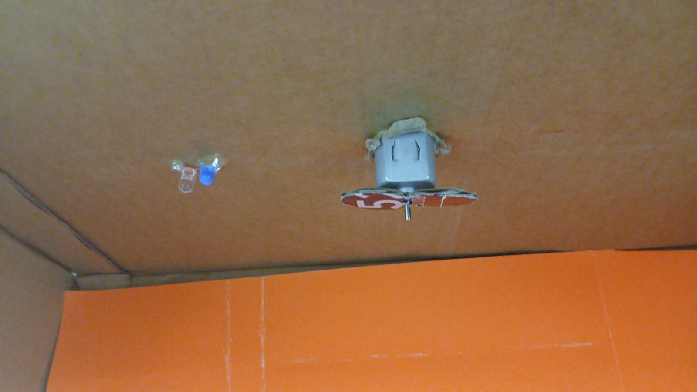
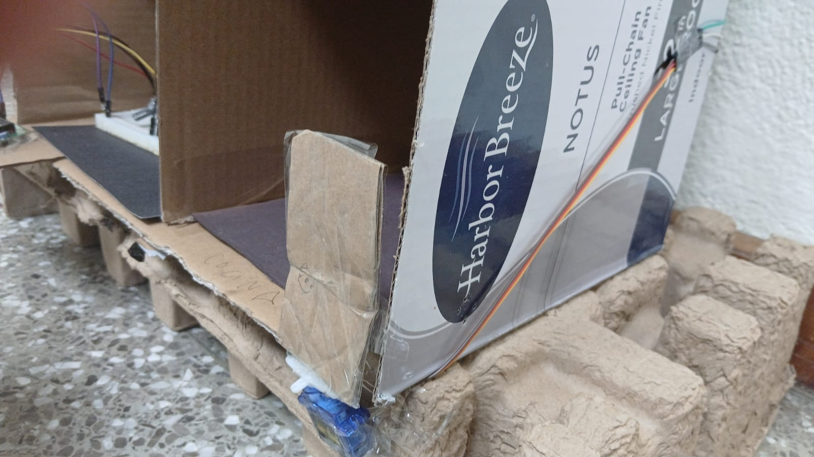

# Implementación del Ventilador y Puerta

## Descripción

Como parte del proyecto SmartHome GT, se desarrolló la implementación correspondiente al **control del ventilador y la puerta automática**.

Las funciones implementadas fueron:

* Control del servomotor para abrir y cerrar la puerta.
* Lectura de un botón mediante `INPUT_PULLUP` para cambiar el estado de la puerta.
* Encendido del ventilador al iniciar el sistema.
* Métodos independientes para encender y apagar el ventilador.
* Envío de mensajes al Monitor Serial para verificar el funcionamiento de cada acción.

---

# Código del Arduino

```cpp
#include <Servo.h>

#define PIN_SERVO 9
#define PIN_BOTON 2
#define PIN_VENTILADOR 8

Servo puerta;

bool puertaAbierta = false;
bool ultimoEstadoBoton = HIGH;

void setup()
{
  Serial.begin(9600);

  pinMode(PIN_BOTON, INPUT_PULLUP);
  pinMode(PIN_VENTILADOR, OUTPUT);

  puerta.attach(PIN_SERVO);

  puerta.write(0);

  encenderVentilador();
  Serial.println("Inicio correcto");
}

void loop()
{
  bool estadoBoton = digitalRead(PIN_BOTON);

  // Detectar pulsación
  if (ultimoEstadoBoton == HIGH && estadoBoton == LOW)
  {
    if (puertaAbierta)
    {
      cerrarPuerta();
    }
    else
    {
      abrirPuerta();
    }

    delay(300);
  }

  ultimoEstadoBoton = estadoBoton;
}

void abrirPuerta()
{
  puerta.write(90);
  puertaAbierta = true;

  Serial.println("Puerta abierta");
}

void cerrarPuerta()
{
  puerta.write(0);
  puertaAbierta = false;

  Serial.println("Puerta cerrada");
}

void encenderVentilador()
{
  digitalWrite(PIN_VENTILADOR, HIGH);

  Serial.println("Ventilador ON");
}

void apagarVentilador()
{
  digitalWrite(PIN_VENTILADOR, LOW);

  Serial.println("Ventilador OFF");
}
```

---

# Implementación Física

### Evidencias

### Montaje del ventilador


### Montaje de la puerta



---

# Simulación en Tinkercad

Enlace al circuito desarrollado en Tinkercad:

**https://www.tinkercad.com/things/ljOnjSwCUcr-proyectoorga/editel?returnTo=https%3A%2F%2Fwww.tinkercad.com%2Fdashboard%2Fdesigns%2Fcircuits&sharecode=_GousgrHo0OudCZK6S820N_mVigAhwOkEYQKRyPs7V0**

---
